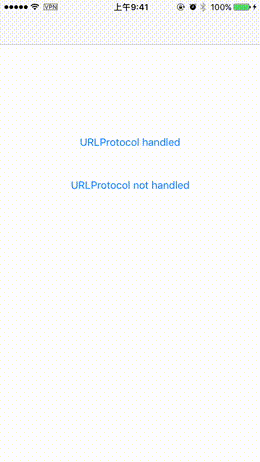

# NSURLProtocol+WebKitSupport

This example project shows a way to use NSURLProtocol with WKWebView, which was not possible by default.

# Screenshot



# Usage

Drag `NSURLProtocol+WebKitSupport.h` and `NSURLProtocol+WebKitSupport.m` into your project, then

```objc
[NSURLProtocol wk_registerScheme:@"https"]; // Register a scheme to WebKit for NSURLProtocol to handle.
[NSURLProtocol registerClass:[MyURLProtocol class]]; // Use your own NSURLProtocol subclasses as before.

[NSURLProtocol wb_unregisterScheme:@"https:"]; // Remove the scheme from registery.
```

# Note

This category uses undocumented APIs in WebKit. By now I don't know if it will get rejected by Apple, but this is very likely. 
